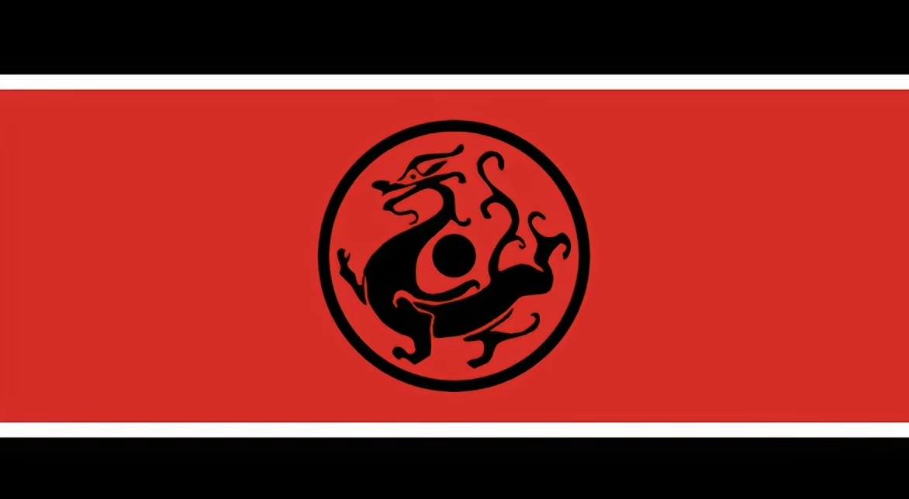

# 永州文旅黑龙旗事件

## 时间
 - 2026年1月15日，徐州网友在永州市，冷水滩体育中心内树上（永州市已把该树分给徐州）悬挂[汉朝黑龙旗](images/首次悬挂的黑龙旗.png) 
 - 2026年1月15日，永州市文旅称收到举报，并撤下黑龙旗
 - 2026年1月16日，重新悬挂了一个[汉旗](images/二次悬挂的汉旗.png)
 - 2026年1月16日，同日晚间，永州市市民做了一个[更大的黑龙旗](images/二次悬挂的黑龙旗.png)，在原地由一位[女生徒手竖起](images/女生扛旗.png)
 - 2026年1月17日，更多网友前来打卡，进一步加热互联网

## 地点
湖南省，永州市，冷水滩体育中心

## 事件描述
今日，湖南省永州市，计划在冷水滩体育中心举办足球赛事，苏州十三太保在体育中心宣传造势，为苏超加油，十三太保分别在周边树上悬挂自己的宣传标牌，其中，徐州悬挂黑龙大汉旗。

后被永州市文旅局撤掉，声称收到网友举报而撤下。

后续，永州市民纷纷声援，并亲自制作更大的黑龙旗，在同地点，重新悬挂并守护。

后续，被网络传播扩散后，成为热点，有网友经过查询发现，永州文旅广电局副局长孙耀梅是满族人。

#### 相关资料
[孙耀梅百科](https://baike.baidu.com/item/%E5%AD%99%E8%80%80%E6%A2%85/57257871)

[孙耀梅-本地备份](孙耀梅.md)

## 信息补充
如需完善更多信息，请提交pr或请在issues中提issue
